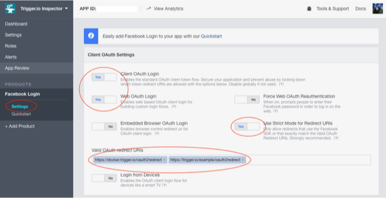

Using the OAuth module with Facebook
====================================

The setup process is lengthy but relatively straightforward.

Due to the way Facebook handles OAuth the most complicated part will be handling the `redirect_uri` configuration.

* Traditionally OAuth requires you to specify a URL which the remote OAuth server uses to redirect control back to your app once authorization is complete.
* Recently Google et al have done some great work on securing OAuth for native clients and came up with a spec: [draft-ietf-oauth-native-apps-12](https://tools.ietf.org/html/draft-ietf-oauth-native-apps-12)
* Amongst others this requires native apps to add a custom URL handler for the redirect url. For example: `some-custom-scheme://oauth2redirect`
* Unfortunately Facebook haven't implemented support for this yet. (It's literally as simple as Facebook allowing schemes other than http and https in the config page!!!)
* So until Facebook get round to implementing full support for native app OAuth we need to use a horrible hack to redirect the OAuth flow back to your app.
* To do this you will need to set up a static HTML page on a URL such as `https://yoursite.com/oauth2redirect`

We'll walk through the full details below but I thought I'd mention it up front to avoid confusion :-)

Let's get started!

## Step 1: Facebook App Page => Settings => Basic

Go to your app on [https://developers.facebook.com](https://developers.facebook.com) and make sure your app is configured correctly for OAuth:

* Make a note of your App ID & App Secret. These correspond to `client_id` & `client_secret` respectively in the oauth provider config.
* If you have not already, click **+ Add Platform**, add *Website* and enter the URL of your website. e.g. `https://yoursite.com`

If you're using a domain for the OAuth redirect which is different to what you have specified for your *Site URL* then you'll want to add it to *App Domains*. We'll get into more details below but you'll probably just set this to `yoursite.com`

## Step 2: Facebook App Page => Settings => Advanced

* Set **Native or desktop app?** to *Yes*
* Set **Is App Secret embedded ...** to *No*

## Step 3: Facebook App Page => Products => Facebook Login => Settings

* Set **Client OAuth Login** to *Yes*
* Set **Web OAuth Login** to *Yes*
* Set **Use Strict Mode for Redirect URIs** to *Yes*

We'll get more into the details below but, for now, set **Valid OAuth redirect URI's** to a URL on your site where you can post a static HTML page. For example: `https://yoursite.com/oauth2redirect`

I've verified that these settings work, but it's also a good idea to read the [Facebook Login Security](https://developers.facebook.com/docs/facebook-login/security/) documentation and go through the rest of the settings.

## Step 4: Set up the OAuth redirect page.

Post a static HTML page to your site at a URL such as `https://yoursite.com/oauth2redirect`

There are many ways to handle the redirect but you can just copy this simple example:

[https://trigger.io/example/oauth2redirect](https://trigger.io/example/oauth2redirect)

The important bit is here:

    

Facebook login will redirect the OAuth flow to this page which will simply modify the URL and redirect it to the apps custom URL protocol: `io.trigger.example.oauth2`

For your site, set the `newOrigin` variable to something like: `com.yoursite.oauth2`

## Step 5: Configure the oauth module.

In your apps `src/config.json` configure the oauth module to look something like this:

    "oauth": {
            "config": {
                "redirect_scheme": "com.yoursite.oauth2",
                "providers": [
                    {
                        "name": "facebook",
                        "client_id": "your facebook app id",
                        "client_secret": "your facebook app secret",
                        "authorization_endpoint": "https://www.facebook.com/dialog/oauth",
                        "token_endpoint": "https://graph.facebook.com/v2.10/oauth/access_token",
                        "redirect_uri": "https://yoursite.com/oauth2redirect",
                        "authorization_scope": "public_profile email user_about_me"
                    }
                ]
            },
            "version": "0.1"
        }

Double check that the `redirect_uri` field is set to the location you chose for the static redirect page you created above.
`authorization_scope` corresponds to the [Facebook permissions list](https://developers.facebook.com/docs/facebook-login/permissions/).

## Step 6: Try to login!

    forge.oauth.authorize("facebook", function (endpoint) {
        forge.logging.log("forge.oauth.authorize succeeded: " + endpoint);
    }, function (error) {
        forge.logging.error("forge.oauth.authorize failed: " + JSON.stringify(error));
    });

## Step 7: Try to make an API call

    forge.oauth.authorize("facebook", function (endpoint) {
        forge.oauth.actionWithToken(endpoint, function (token) {
            $.ajax({
                url: "https://graph.facebook.com/v2.10/me",
                headers: {
                    "Authorization": "Bearer " + token.access
                },
                success: function (data) {
                    forge.logging.log("API call succeeded: " + JSON.stringify(data));
                },
                error: function (error) {
                    forge.logging.error("API call failed: " + JSON.stringify(error));
                }
            });
        }, function (error) {
            forge.logging.error("forge.oauth.actionWithToken failed: " + JSON.stringify(error));
        });

    }, function (error) {
        forge.logging.error("forge.oauth.authorize failed: " + JSON.stringify(error));
    });

That's it, if you've made it this far you're now ready to begin exploring the [Facebook Graph API](https://developers.facebook.com/docs/graph-api) REST endpoints!
